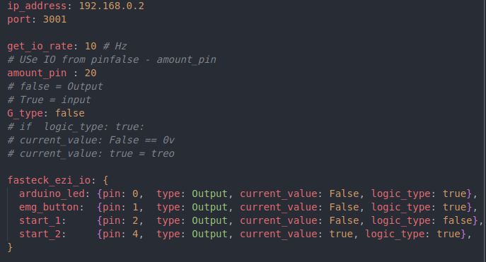

# fastech_io

```
---
Athor: Pham Quang Minh
Date: Jen 2023
MKAC
---
```

## **Requirements**

This package is used to communicate with Fastech IO module Ethernet.

## **Configuration**

<details>
  <summary>File config</summary>

File: `cfg/ethernet_io_1.yaml`



Parameter explanation :

- ip_address : Được cài trên phần cứng của board

    

- port: Mặc định là 3001
- get_io_rate: Tần số phản hồi của board fastech_io
- amount_pin: Số pin (IO) được xử lý ( trên thị trường hiện nay chỉ có 2 loại là 16 pin và 32 pin )

    *Chú ý :*

    - C*ó thể đặt giá trị* amount_pin tùy thuộc vào thực tế xử dụng VD: như phần cứng sử dụng loại 32 pin nhưng chỉ cần xử lý 20 pin thì có thể cài đặt amount_pin = 20, điều này ảnh hưởng đến phần monitor ( hiển thị topic /io_mornitor ) ngoài ra khi cài đặt điều này tránh việc can thiệp từ pin 21 - 32. Tuy nhiên nếu sử dụng board có số pin ít hơn giá trị amount_pin thì việc can thiệp này không có giá trị .
    - Nên cài đặt giá trị amount_pin = số IO thực tế xử dụng hoặc bằng số IO trên mạch thực tế.
- G_type: Giá trị ( bool ).
    - Nếu G_type = False (0) cài đặt cho mạch *Output.*
    - Nếu G_type = True (1)  cài đặt cho mạch *Input.*
- fasteck_ezi_io : Được sử dụng để tạo giá trị bắt đầu ( giá trị khởi tạo cho mạch ) có thể có hoặc không, khuyến cáo nên cài đặt đủ tham số của tất cả các IO sử dụng. Hiện có 2 loại được xử dụng là ( fasteck_ezi_i dùng cho board input và fasteck_ezi_0 sử dụng cho board Output )
    - fasteck_ezi_0

        

        - type : Nếu type có giá trị là Const thì k thể can thiệp vào giá trị on/off từ topic
        - current_value: Giá trị khởi tạo ban đầu,  nếu không khởi tạo thì mặc định là False , nếu giá trị = True khi chương trình bắt đầu chạy sẽ on pin đó lên, đèn trên IO sẽ sáng và topic sẽ hiển thị là on

            

        - logic_type: Khởi tạo giá trị logic cho pin đó. Nếu logic_type = true khi on, khi current_value = true thì sẽ pin đó sẽ = 0v, nếu current_value = False thì pin đó sẽ treo lên và ngược lại
            - Lưu ý: Logic_type chỉ được thay đổi tại file param ( yaml ) này, không thể thay đổi giá trị bằng topic như current_value
    - fasteck_ezi_I

        

        - type : Loại board được xử dụng. Giá trị được xử dụng là Input hay Output nếu sử dụng đơn lẻ thì không có sự khác biệt ( ngoài giá trị Const tuy nhiên đối với board Input , sự khác nhau nằm ở khi kết nối nhiều board với nhau )
        - logic_type: khởi tạo giá trị logic cho mạch Input. Nếu logic_type = true thì khi chương trình được khởi chạy, đèn trên board sẽ sáng và khi có đầu vào (cấp vào 0v) chân đó thì đèn và logic sẽ tắt . Nếu  logic_type = False hoặc không khai báo thì đèn trên thiết bị sẽ tắt và cấp 0v vào pin đó sẽ on lên
</details>

## Communation
<details>
  <summary>Input</summary>

#### User Services `~set_value_io`
`srv/SetValueOutput.srv`

```jsx
# number pin change: 0 - 31
int8 pin
# value change : True{on} , False {off}
bool value
# mode: Currently there are 2 modes, mod = 1 just on/off , mod = 2 Pwm
int8 mode

# use only when mod = 2, if mod = 1 nothing change
# period_ms = cycle pwm = ontime + offtime, max_period_ms = 65535
int64 period_ms
# ontime_ms = period_ms - time_off, max_ontime_ms = 65535
int64 ontime_ms
# total number toggle
int64 conut_time , max_cout_time = 4294967295, mid_cout_time = 1
---
# 0: NG
# 1: OK
bool result
```
</details>

<details>
  <summary>Output</summary>


`io_mornitor + type_io + ip_address`


 `standard_io_pub + type_io + ip_address`


*standrd_io chỉ xuất hiện khi thỏa mãn 2 trường hợp :*

- *Giá trị được on lên*
- *Đã được khai báo ở file config ở trên*
</details>

## Funtion
<details>
  <summary>Một số hàm</summary>

#### [check_enough_bytes(self)](https://gitlab.com/mkac-agv/fastech_io/-/blob/master/scripts/ethernet_io.py#L448)

- Hàm này sẽ nhận dữ liệu của 1 binary gồm N phần tử
- Kiểm tra số phần tử xem có phải là 8 hay không, nếu != 8 sẽ tự động tách và thêm giá trị 0 vào để mỗi chuyển = 8 và không thay đổi giá trị thực tế của nó
- Hàm sẽ trả ra giá trị byte đủ

#### [set_controller_params(self)](https://gitlab.com/mkac-agv/fastech_io/-/blob/master/scripts/ethernet_io.py#L687)
- Chưa biết giải thích hàm này thế nào, chủ yêú là nó sẽ nhận  2 giá trị là frametype và  reply_data_sending , giá trị của frametype được lấy từ  [gitlab](https://gitlab.com/mkac-agv/fastech_io/-/blob/master/scripts/structure_frame.py) sau đó nó sẽ tự tính toán các giá trị như số bit, giá trị phản hồi …, chỉ cần gửi đúng giá trị của reply_data_sending chương trình sẽ hoạt động chính xác

#### [set_trigger(self)](https://gitlab.com/mkac-agv/fastech_io/-/blob/master/scripts/ethernet_io.py#L375)

- - Do thư viện của FAS_SetTrigger bị ngược so với thư viện của các hàm khác, nên khi chuyển đổi qua lại cần phải đảo lại byte của tham số

</details>

## Usage
- Run `roslaunch fashtech_io fashtech_io.launch`

## Tham khảo
[1]. []()