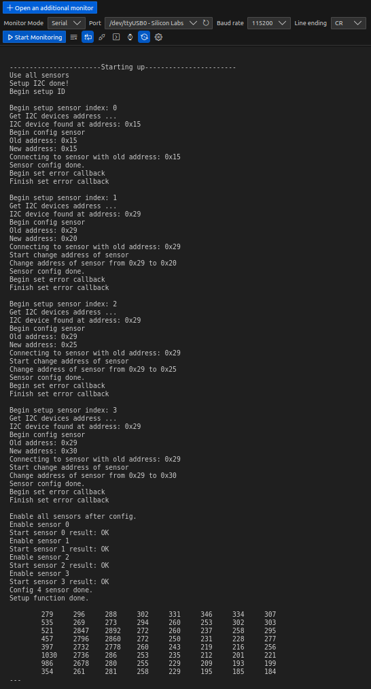
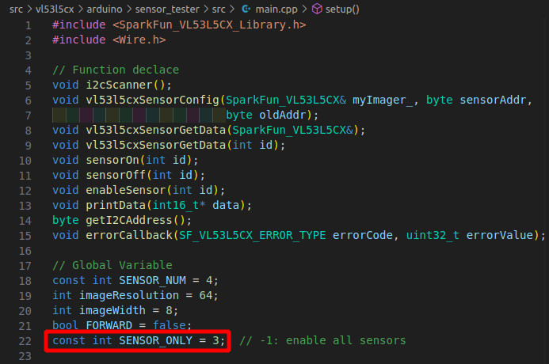
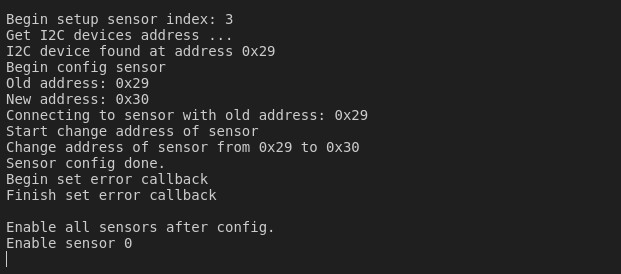
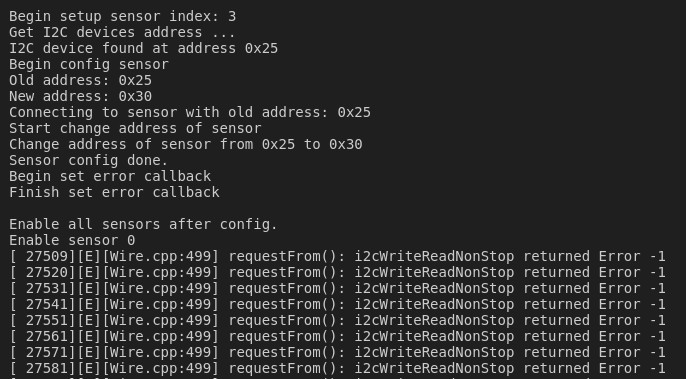

# Kiểm tra nhiễu cảm biến quang ToF

## Cài đặt firmware

- Tên chương trình: sensor_tester (Chú ý cài các thư viện cần thiết)
- Sơ đồ chân: Chân enable của 4 cảm biến lần lượt nối với các chân GPIO 15, 4, 14, 12

## Chạy chương trình

Nếu đọc cả 4 sensor bị lỗi => đọc từng sensor.

#### Test đọc cả 4 sensor

- Nhấn reset button trên arduino để chạy lại chương trình
- Sử dụng Serial Monitor (Trên VSCode hoặc trên Arduino IDE) để theo dõi cảm biến
- Chương trình sẽ lần lượt hiện các dòng sau trên Serial Monitor
  
  Led màu xanh trên ESP32 sẽ nháy 2 lần khi khởi động, nháy 1 lần khi config xong
  1 sensor, nháy 2 lần khi config xong cả 4 sensor, nháy đều liên tục chu kỳ 400 ms
  khi vào hàm loop() đọc dữ liệu liên tục.
- Nếu chương trinh dừng ở một trong các bước trên, hãy kiểm tra lại:
  - Sơ đồ chân
  - Xác nhận kết nối I2C chính xác (Đúng dây, đúng trở)
  - Xác nhận cảm biến không bị lỗi (Có thể thử bằng thay cảm biến)
  - Sau khi xác nhận phần cứng không gặp vấn đề, hãy nhấn nút reset để chạy lại.
- Sử dụng các mã lệnh sau để cài đặt cảm biến cần test và độ ổn định, truyền qua Serial Monitor (Để truyền dạng hex):
  - Từ 00 đến 03: Tương ứng với số thứ tự cảm biến muốn test
  - Từ 04 đến FF: Tương ứng với sai số cần test. Khi cảm biến đo được giá trị sau lệch so với giá trị trước lớn hơn con số này (Mặc định là 0x50, tương ứng với mã hexa là 32), thì chương trình sẽ gửi bảng kết quả sai số qua serial. Nếu tất cả các vùng đo đều ra sai số nhỏ hơn số này, thì chương trình sẽ không gửi gì lên Serial Monitor. Ví dụ: nếu cài đặt là 32, tương ứng với 0x50, thì khi giá trị khoảng cách đó được ở một ô bất kỳ có sự sai lệch giữa 2 lần đo liên tiếp lớn hơn 50, thì chương trình sẽ gửi kết quả sai lệch của lần đo đó qua serial.
- Đặt một vật chắn lớn trước cảm biến cần test (Để kết quả trả về không bị nhiễu), căn chỉnh sao cho chương trình không gửi kết quả lên.
  
- Điều khiển động cơ quay, nếu cảm biến bị nhiễu với sai số lớn hơn sai số cài đặt, thì chương trình sẽ gửi kết quả lên Serial Monitor. Nếu không thấy có kết quả gửi lên, tức là cảm biến không bị nhiễu bởi động cơ (Hãy xác nhận cảm biến vẫn hoạt động bình thường bằng cách đưa tay qua cảm biến, khi đó chương trình sẽ gửi kết quả lên serial)
- Lặp lại bài thử với cả 4 cảm biến bằng cách gửi lệnh từ 00 đến 03 để thay đổi cảm biến.

#### Đọc từng sensor (nếu đọc cả 4 sensor bị lỗi)

Sửa giá trị biến `SENSOR_ONLY`:

Các giá trị:

- `-1`: (Mặc định) enable và đọc cả 4 sensor
- `0, 1, 2, hoặc 3`: ID của sensor muốn enable

## Lỗi có thể xảy ra

- Nếu test đọc cả 4 sensor lỗi => đọc từng sensor.
- Nếu test đọc từng sensor lỗi cả 4 => thử thay VĐK (ESP32), thử thay cable, thử thay từng cảm biến.
- Nếu đọc từng sensor OK nhưng đọc cả 4 sensor lỗi => thay từng sensor.
  Chú ý: sensor có thể lỗi khi lắp ở vị trí này nhưng lắp sang vị trí khác có thể
  OK => thử đổi chỗ các sensor.
- 1 số lỗi có thể xảy ra khi đọc từng sensor OK nhưng đọc cả 4 sensor bị lỗi:
  - Bị tắc khi enable 1 sensor nào đó sau khi đã setup địa chỉ thành công cho cả 4 sensor => thay sensor bị lỗi:
    
  - Lỗi không enable được 1 sensor nào đó sau khi đã setup địa chỉ thành công cho cả 4 sensor => Lỗi này không chỉ định rõ sensor nào bị lỗi => thay từng sensor:
    
